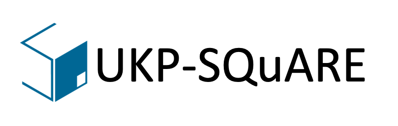
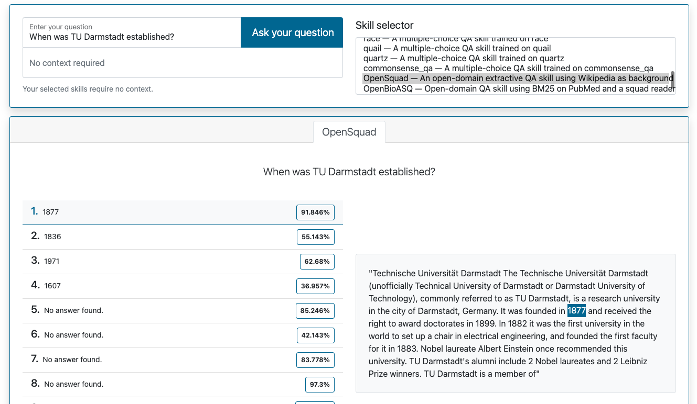
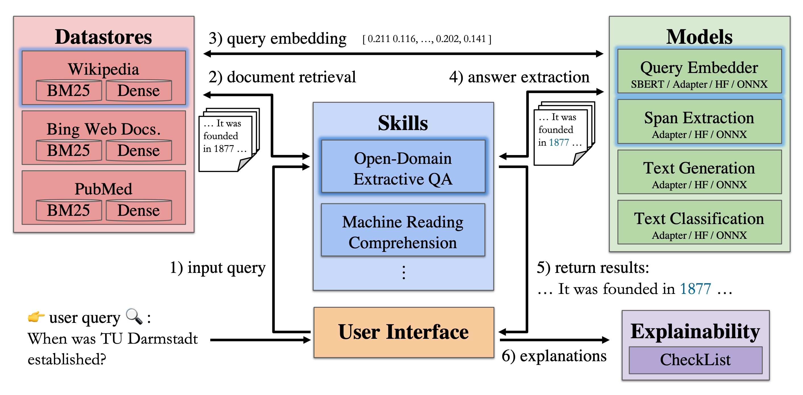

<p align="center">
    <br>
    
    <br>
<p>
<p align="center">
    <!-- Going to also have licens, release version, paper doi, twitter, etc. here -->
    <a href="https://square.ukp-lab.de/">
        
    </a>
    <a href="https://square.ukp-lab.de/docs/">
        
    </a>
    <a href="https://github.com/UKP-SQuARE/square-core">
        
    </a>
    <a href="https://arxiv.org/abs/2203.13693">
        
    </a>
    <a href="https://arxiv.org/abs/2208.09316">
        
    </a>
</p>


<h3 align="center">
    <p>Flexible and Extensible Question Answering Platform</p>
</h3>

<!-- Introduction of SQuARE -->
SQuARE is a flexible and extensible Question Answering (QA) platform to enable users to easily implement, manage and share their custom QA pipelines (aka Skills in SQuARE).

Two ways are supported to use SQuARE:
1. 🌐 Get access to the existing QA Skills (and even deploy your Skill!) via our [demo page](https://square.ukp-lab.de/);
2. 💾 Or clone and install SQuARE to host services on a local machine.

## Why SQuARE?

Recent advances in NLP and information retrieval have given rise to a diverse set of question answering tasks that are of different formats (e.g., extractive, abstractive), require different model architectures (e.g., generative, discriminative) and setups (e.g., with or without retrieval). Despite having a large number of powerful, specialized QA pipelines (a.k.a., Skills) that consider a single domain, model or setup, there exists no framework where users can easily explore and compare such pipelines and can extend them according to their needs. 

To address this issue, we present SQuARE, an extensible online QA platform for researchers which allows users to query and analyze a large collection of modern Skills via a user-friendly web interface and integrated behavioural tests. In addition, QA researchers can develop, manage and share their custom Skills using our microservices that support a wide range of models (Transformers, Adapters, ONNX), datastores and retrieval techniques (e.g., sparse and dense).

Find out more about the project on [UKPs Website](https://www.informatik.tu-darmstadt.de/ukp/research_ukp/ukp_research_projects/ukp_project_square/ukp_project_square_details.en.jsp).  

## Get Started
👉 If you want to use the SQuARE public service online, you can refer to [Online Service](#Online-Service) for using the existing skills and refer to 
[Add New Skills](#Add-New-Skills) for adding new skills.

👉 If you want to deploy SQuARE locally yourself, please refer to [Local Installation](#Local-Installation).

👉 For illustration of the architecture, please refer to [Architecture](#Architecture).

👉 And welcome to [contact us](#Contact).

## Online Service
Try out the on-the-go skills on the [demo page](https://square.ukp-lab.de/)! The existing skills include span-extraction, abstractive, multi-choice QA with contexts or without contexts (open QA based on retrieval).
<details open>
    <summary>Screenshot</summary>
    <p align="center">
        <br>
        
        <br>
    <p>
</details>

## Add New Skills
To add new skills, please see the [skills](https://github.com/UKP-SQuARE/square-core/tree/master/skills#add-new-skills) section.

## Local Installation
### Requirements
To run UKP-SQuARE locally, you need the following software:
* [docker](https://docs.docker.com/get-docker/)
* [docker-compose](https://docs.docker.com/compose/install/#install-compose)
* [ytt](https://carvel.dev/ytt/)
* [jq](https://stedolan.github.io/jq/download/)

### Install
Next change the `environment` to `local` and `os` to your operating system in the [config.yaml](https://github.com/UKP-SQuARE/square-core/tree/master/config.yaml).   
Now, modify your `/etc/hosts` to contain:
```
127.0.0.1   square.ukp-lab.localhost
```  
For installation we provide a script that takes care of the entire setup for you. After installing the previous [requirements](#requirements), simply run:
```bash
bash install.sh
```
### Run 
Finally, you can run the full system with docker-compose. Before doing so, you might want to reduce the number of models running depending on your resources. To do so, remove the respective services from the docker-compose.
```bash
docker-compose up -d
```
Check with `docker-compose logs -f` if all systems have started successfully. Once they are up and running go to [square.ukp-lab.localhost](https://square.ukp-lab.localhost).
👉 Accept that the browser cannot verify the certificate.
### Add Skills
Add Skills according to the [Add New Skills](https://github.com/UKP-SQuARE/square-core/tree/master/skills/README.md#add-new-skills) section. Note that, for open-domain skills the datastore need to created first.

## Architecture
For a whole (open QA) skill pipeline, it requires 6 steps:
1. First a user selects a Skill and issues a query via the user interface;
2. The selected QA Skill forwards the query to the respective Datastore for document retrieval;
3. The Datastore gets the query embedding from the Models, uses it for semantic document retrieval and returns the top documents to the Skill;
4. The Skill sends the query and retrieved documents to the reader model for answer extraction;
5. Finally, the answers are shown to the user;
6. Optionally, the user can view the results of the predefined behavioural tests for the Skill. 
<p align="center">
        <br>
        
        <br>
    <p>

## Contact

<!-- If you find this repository helpful, feel free to cite our publication [UKP-SQUARE: An Online Platform for Question Answering Research]():

```
@inproceedings{
}
``` -->

The current main contributors of this repository are:
- [Tim Baumgärtner](https://github.com/timbmg), [Kexin Wang](https://github.com/kwang2049), [Rachneet Singh Sachdeva](https://github.com/Rachneet), [Haritz Puerto](https://github.com/HaritzPuerto), [Hao Zhang](https://github.com/HaoZ-Work), [Sewin Tariverdian](https://github.com/SevenDaysDA)

Contact person: [Haritz Puerto](mailto:puerto@ukp.informatik.tu-darmstadt.de) (UI and general questions), [Tim Baumgärtner](mailto:baumgaertner@ukp.informatik.tu-darmstadt.de) (Skills), [Kexin Wang](mailto:kexin.wang.2049@gmail.com) (Datastores), [Rachneet Singh Sachdeva](mailto:sachdeva@ukp.informatik.tu-darmstadt.de) (Models), 

Previous contributors:
- [Max Eichler](https://github.com/maexe), [Gregor Geigle](https://github.com/gregor-ge), [Clifton Poth](https://github.com/calpt), [Hannah Sterz](https://github.com/hSterz)

[https://www.ukp.tu-darmstadt.de/](https://www.ukp.tu-darmstadt.de/)

Don't hesitate to send us an e-mail or report an issue, if something is broken (and it shouldn't be) or if you have further questions.

## Citation
If you find our work useful, please consider citing our ACL and AACL papers.

[SQuARE v1@ACL 2022 Demo Track](https://aclanthology.org/2022.acl-demo.2/).      
```bibtex
@inproceedings{baumgartner-etal-2022-ukp,
    title = "{UKP}-{SQ}u{ARE}: An Online Platform for Question Answering Research",
    author = {Baumg{\"a}rtner, Tim  and
      Wang, Kexin  and
      Sachdeva, Rachneet  and
      Geigle, Gregor  and
      Eichler, Max  and
      Poth, Clifton  and
      Sterz, Hannah  and
      Puerto, Haritz  and
      Ribeiro, Leonardo F. R.  and
      Pfeiffer, Jonas  and
      Reimers, Nils  and
      {\c{S}}ahin, G{\"o}zde  and
      Gurevych, Iryna},
    booktitle = "Proceedings of the 60th Annual Meeting of the Association for Computational Linguistics: System Demonstrations",
    month = may,
    year = "2022",
    address = "Dublin, Ireland",
    publisher = "Association for Computational Linguistics",
    url = "https://aclanthology.org/2022.acl-demo.2",
    doi = "10.18653/v1/2022.acl-demo.2",
    pages = "9--22",
}

```
[SQuARE v2@AACL 2022 Demo Track](https://arxiv.org/abs/2208.09316).      

```bibtex
@article{Sachdeva2022UKPSQuARE,
  title={{UKP}-{SQ}u{ARE} v2 Explainability and Adversarial Attacks for Trustworthy QA},
  author={Rachneet Sachdeva and Haritz Puerto and Tim Baumgartner and Sewin Tariverdian and Hao Zhang and Kexin Wang and Hossain Shaikh Saadi and Leonardo F. R. Ribeiro and Iryna Gurevych},
  journal={arXiv preprint arXiv:2203.13693},
  year={2022}
}

```
        
> This repository contains experimental software and is published for the sole purpose of giving additional background details on the respective publication.
