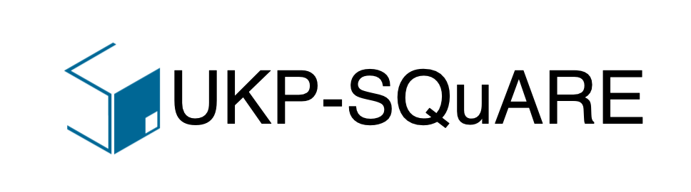

<p align="center">
    <br>
    
    <br>
<p>
<p align="center">
    <!-- Going to also have licens, release version, paper doi, twitter, etc. here -->
    <a href="http://square.ukp-lab.de/">
        
    </a>
    <a href="https://github.com/UKP-SQuARE/square-core">
        
    </a>
</p>


<h3 align="center">
    <p>Flexible and Extensible Question Answering Platform</p>
</h3>

<!-- Introduction of SQuARE -->
SQuARE is a flexible and extensible Question Answering (QA) platform to enable users to easily implement, manage and share their custom QA pipelines (aka Skills in SQuARE).

Two ways are supported to use SQuARE:
1. 🌐 Get access to the existing QA Skills (and even deploy your Skill!) via our [demo page](http://square.ukp.informatik.tu-darmstadt.de/);
2. 💾 Or clone and install SQuARE to host services on a local machine.

## Why SQuARE?

Recent advances in NLP and information retrieval have given rise to a diverse set of question answering tasks that are of different formats (e.g., extractive, abstractive), require different model architectures (e.g., generative, discriminative) and setups (e.g., with or without retrieval). Despite having a large number of powerful, specialized QA pipelines (a.k.a., Skills) that consider a single domain, model or setup, there exists no framework where users can easily explore and compare such pipelines and can extend them according to their needs. 

To address this issue, we present SQuARE, an extensible online QA platform for researchers which allows users to query and analyze a large collection of modern Skills via a user-friendly web interface and integrated behavioural tests. In addition, QA researchers can develop, manage and share their custom Skills using our microservices that support a wide range of models (Transformers, Adapters, ONNX), datastores and retrieval techniques (e.g., sparse and dense).

Find out more about the project on [UKPs Website](https://www.informatik.tu-darmstadt.de/ukp/research_ukp/ukp_research_projects/ukp_project_square/ukp_project_square_details.en.jsp).  

## Get Started
👉 If you want to use the SQuARE public service online, you can refer to [Online Service](#Online-Service) for using the existing skills and refer to 
[Add New Skills](#Add-New-Skills?) for adding new skills.

👉 If you want to deploy SQuARE locally yourself, please refer to [Local Installation](#Local-Installation).

👉 For illustration of the architecture, please refer to [Architecture](#Architecture).

👉 And welcome to [contact us](#Contact).

## Online Service
Try out the on-the-go skills on the [demo page](http://square.ukp.informatik.tu-darmstadt.de/)! The existing skills include span-extraction, abstractive, multi-choice QA with contexts or without contexts (open QA based on retrieval).
<details open>
    <summary>Screenshot</summary>
    <p align="center">
        <br>
        
        <br>
    <p>
</details>

## Add New Skills

### Step 1: Hosting New Skills
- If you want to add new skills to the [public service](http://square.ukp-lab.de/), please follow the skill-package examples (e.g. [skills/qa-retrieve-span-skill](skills/qa-retrieve-span-skill)) and submit yours to the [pull requests](https://github.com/UKP-SQuARE/square-core/pulls). We will make it running after code review;
- It is also OK to host the skill yourself somewhere else. The only thing that matters here is to provide a URL and also match the arguments formats.

### Step 2 (for Local Hosts Only): .env Setup 
Create `.env` files for each skill, e.g. under `skills/qa-boolq-skill/.env` with the following content:
```bash
MODEL_API_KEY=your-api-key-goes-here
MODEL_API_URL=http://model_nginx:8080/api
DATA_API_URL=http://host.docker.internal:8002/datastores
```
When running the project locally, provide any api key e.g. `1234-abcd-5678-efgh`.

Next, create your user and password with `htpasswd` and add it under `square-model-inference-api/traefik/traefik.yaml`.

### Step 3: Register the Skill
Go to your user profile and click on "My Skills" and "New" buttons. Fill out the form and link it to the hosted skills:

<details open>
    <summary>Example: Skill Form Filling</summary>
    <p align="center">
        <br>
        
        <br>
    <p>
</details>

## Local Installation
For local development it's best to build the project with docker compose by running `docker compose build`.  
If you just want to use the current system, you can pull all images from docker hub with `docker compose pull`.  
And finally run `docker compose up -d` to start the system.  

## Architecture
For a whole (open QA) skill pipeline, it requires 6 steps:
1. First a user selects a Skill and issues a query via the user interface;
2. The selected QA Skill forwards the query to the respective Datastore for document retrieval;
3. The Datastore gets the query embedding from the Models, uses it for semantic document retrieval and returns the top documents to the Skill;
4. The Skill sends the query and retrieved documents to the reader model for answer extraction;
5. Finally, the answers are shown to the user;
6. Optionally, the user can view the results of the predefined behavioural tests for the Skill. 
<p align="center">
        <br>
        
        <br>
    <p>

## Contact

<!-- If you find this repository helpful, feel free to cite our publication [UKP-SQUARE: An Online Platform for Question Answering Research]():

```
@inproceedings{
}
``` -->

The main contributors of this repository are:
- [Tim Baumgärtner](https://github.com/timbmg), [Kexin Wang](https://github.com/kwang2049), [Rachneet Singh Sachdeva](https://github.com/Rachneet), [
Max Eichler](https://github.com/maexe), [Gregor Geigle](https://github.com/gregor-ge), [Clifton Poth](https://github.com/calpt), [Hannah Sterz](https://github.com/hSterz)

Contact person: [Tim Baumgärtner](mailto:baumgaertner@ukp.informatik.tu-darmstadt.de) (Skills and general questions), [Kexin Wang](mailto:kexin.wang.2049@gmail.com) (Datastores), [Rachneet Singh Sachdeva](mailto:sachdeva@ukp.informatik.tu-darmstadt.de) (Models)

[https://www.ukp.tu-darmstadt.de/](https://www.ukp.tu-darmstadt.de/)

Don't hesitate to send us an e-mail or report an issue, if something is broken (and it shouldn't be) or if you have further questions.

> This repository contains experimental software and is published for the sole purpose of giving additional background details on the respective publication.
