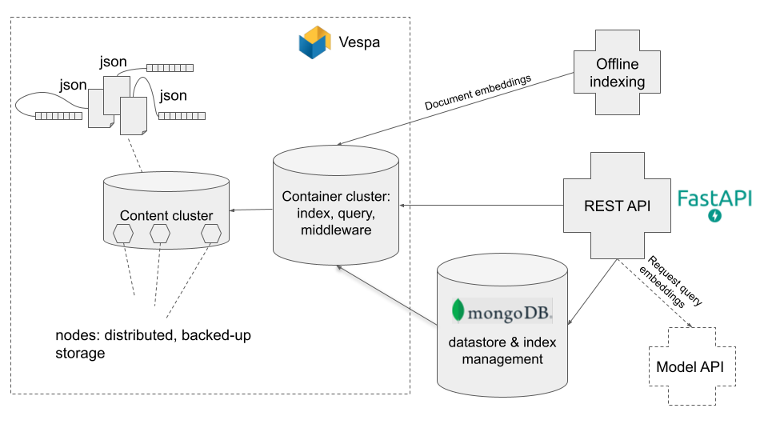

# SQuARE Datastore API

API for storing, indexing and retrieving document corpora, powered by [Vespa](https://vespa.ai).

## Overview



## Requirements

- Python 3.7+
- Docker
- Make (optional)

Python requirements via pip (ideally with virtualenv):
```
pip install -r requirements.txt
```
... or via conda:
```
conda env create -f environment.yml
```

## Setup

### Docker containers

We use Docker containers for:
- Elasticsearch
- Traefik

Additionally, the FAISS storage for each index has an own container.

Everything can be started via Docker Compose:
```
docker compose up --detach
```

And teared down again after usage:
```
docker compose down
```

### API server

Start the server:
```
make run
```

Got to **http://localhost:7000/docs** for interactive documentation.

### Tests

Run API tests (requires Vespa to be running):
```
make test
```

## Upload data

In general, there are two ways to upload documents to the server: via the REST interface of the Datastore API or via the `upload.py` script.

### Uploading via the REST API

The Datastore API provides different methods for uploading documents and embeddings.
Documents are expected to be uploaded as .jsonl files, embeddings as .hdf5 files.

You can download some example documents [here](https://public.ukp.informatik.tu-darmstadt.de/kwang/tutorial/vespa/dense-retrieval/msmarco/0.jsonl).

Now, the documents file can be uploaded to the Datastore API as follows:
```
curl -X 'POST' \
  'http://localhost:7000/datastores/wiki/documents/upload' \
  -H 'Authorization: abcdefg' \
  -F 'file=@0.jsonl'
```

### Uploading via `upload.py`

As an example, we upload the Wikipedia split used by DPR (containing 21M passages) into a datastore named "wiki".

1. First, we download and unzip the documents:
  ```
  curl https://dl.fbaipublicfiles.com/dpr/wikipedia_split/psgs_w100.tsv.gz -o psgs_w100.tsv.gz
  gunzip psgs_w100.tsv.gz
  ```

2. Create the datastore:
  ```
  curl -X 'PUT' \
    'http://localhost:7000/datastores/wiki' \
    -H 'accept: application/json' \
    -H 'Content-Type: application/json' \
    -d '[
    {
      "name": "id",
      "type": "long"
    },
    {
      "name": "title",
      "type": "text"
    },
    {
      "name": "text",
      "type": "text"
    }
  ]'
  ```

3. Upload documents:
  ```
  python upload.py\
    -s wiki \
    -t <access_token> \
    psgs_w100.tsv
  ```
