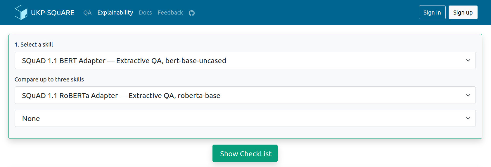
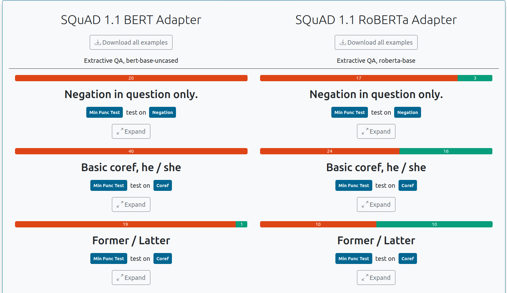
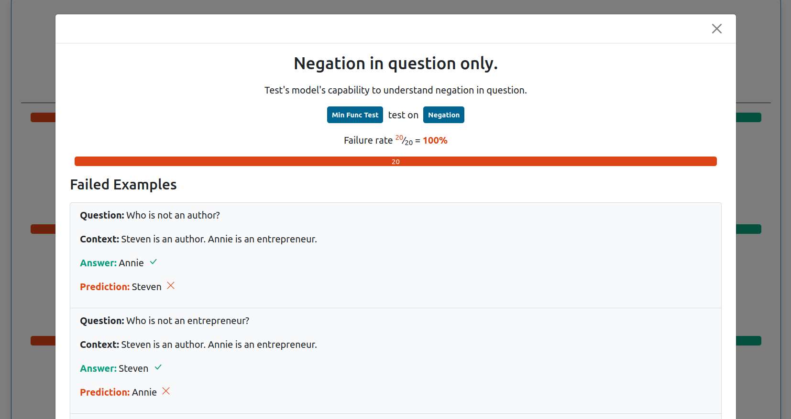

# Explainability

### Overview

The SQuARE platform provides behavioral testing via [Checklist](https://github.com/marcotcr/checklist).
This is achieved by *unit  tests* designed by the end-users or the system experts.
The two most common types are *Minimum Functionality Test (MFT)* and 
*INVariance (INV)* as given in the table below.

| **M**inimum **F**unctionality **T**est (MFT)-*Taxonomy* | **INV**ariance-*Robustness* |
| :-- | :-- |
| **C:** There is a tiny purple box in the room.  |**C:** ...Newcomen designs had a duty of about 7 million, but most were closer to 5 million....  
**Q:** What size is the box?  | **Q:** What was the ideal duty->>udty of a Newcomen engine?  
**Test:** Check if the prediction is tiny.  | **Test:** Check whether the prediction changes or not.  |

MFTs are designed to measure a capability (e.g., Taxonomy capacity of 
matching object properties to categories) via specifying the expected
behaviour (e.g., “tiny” in Table above). INVs tests are similarly
refined for capabilities (e.g., robustness under spelling errors in question),
however the expected behaviour is already known, i.e., the answer should
remain the same.

### Behavioral testing of skills

The users can choose the Skill they want to investigate from the
drop-down menu. The `Show Checklist' button is activated once
the predictions from the tests are saved in a *JSON* file.

Different tests are displayed success and failure rate of the skills. 
An exemplary visualization for testing of SQuAD skill 
is given in Figure below. 

To analyze or process a Skill’s test performance in more detail, 
a full *JSON* report of all test examples can be downloaded using the 
**Download all examples** button. 

To view the failed test cases in more detail, the user can click the 
**Expand** button. This allows the user to quickly identify changes the Skill could not handle.

### Currently supported skills

| Name | Retrieval Model | Datastore | Reader Model | Reader Adapter | Type | Code |
|---|---|---|---|---|---|---|
| BoolQ BERT Adapter |  |  | [bert-base-uncased](https://huggingface.co/bert-base-uncased) | [boolq](https://huggingface.co/AdapterHub/bert-base-uncased-pf-boolq) | categorical | [code](https://github.com/UKP-SQuARE/square-core/blob/master/skills/multiple-choice-qa/skill.py) |
| BoolQ RoBERTa Adapter |  |  | [roberta-base](https://huggingface.co/roberta-base) | [boolq](https://huggingface.co/AdapterHub/roberta-base-pf-boolq) | categorical | [code](https://github.com/UKP-SQuARE/square-core/blob/master/skills/multiple-choice-qa/skill.py) |
| CommonsenseQA BERT Adapter |  |  | [bert-base-uncased](https://huggingface.co/bert-base-uncased) | [commonsense_qa](https://huggingface.co/AdapterHub/bert-base-uncased-pf-commonsense_qa) | multiple-choice | [code](https://github.com/UKP-SQuARE/square-core/blob/master/skills/multiple-choice-qa/skill.py) |
| CommonsenseQA RoBERTa Adapter |  |  | [roberta-base](https://huggingface.co/roberta-base) | [commonsense_qa](https://huggingface.co/AdapterHub/roberta-base-pf-commonsense_qa) | multiple-choice | [code](https://github.com/UKP-SQuARE/square-core/blob/master/skills/multiple-choice-qa/skill.py) |
| CosmosQA BERT |  |  | [bert-base-uncased](https://huggingface.co/bert-base-uncased) | [cosmos_qa](https://huggingface.co/AdapterHub/bert-base-uncased-pf-cosmos_qa) | multiple-choice | [code](https://github.com/UKP-SQuARE/square-core/blob/master/skills/multiple-choice-qa/skill.py) |
| CosmosQA RoBERTa Adapter |  |  | [roberta-base](https://huggingface.co/roberta-base) | [cosmos_qa](https://huggingface.co/AdapterHub/roberta-base-pf-cosmos_qa) | multiple-choice | [code](https://github.com/UKP-SQuARE/square-core/blob/master/skills/multiple-choice-qa/skill.py) |
| DROP BERT Adapter |  |  | [bert-base-uncased](https://huggingface.co/bert-base-uncased) | [drop](https://huggingface.co/AdapterHub/bert-base-uncased-pf-drop) | span-extraction | [code](https://github.com/UKP-SQuARE/square-core/blob/master/skills/extractive-qa/skill.py) |
| DROP RoBERTa Adapter |  |  | [roberta-base](https://huggingface.co/roberta-base) | [drop](https://huggingface.co/AdapterHub/roberta-base-pf-drop) | span-extraction | [code](https://github.com/UKP-SQuARE/square-core/blob/master/skills/extractive-qa/skill.py) |
| HotpotQA BERT Adapter |  |  | [bert-base-uncased](https://huggingface.co/bert-base-uncased) | [hotpotqa](https://huggingface.co/AdapterHub/bert-base-uncased-pf-hotpotqa) | span-extraction | [code](https://github.com/UKP-SQuARE/square-core/blob/master/skills/extractive-qa/skill.py) |
| HotpotQA RoBERTa Adapter |  |  | [roberta-base](https://huggingface.co/roberta-base) | [hotpotqa](https://huggingface.co/AdapterHub/roberta-base-pf-hotpotqa) | span-extraction | [code](https://github.com/UKP-SQuARE/square-core/blob/master/skills/extractive-qa/skill.py) |
| MultiRC BERT Adapter |  |  | [bert-base-uncased](https://huggingface.co/bert-base-uncased) | [multirc](https://huggingface.co/AdapterHub/bert-base-uncased-pf-multirc) | multiple-choice | [code](https://github.com/UKP-SQuARE/square-core/blob/master/skills/multiple-choice-qa/skill.py) |
| MultiRC RoBERTa Adapter |  |  | [roberta-base](https://huggingface.co/roberta-base) | [multirc](https://huggingface.co/AdapterHub/roberta-base-pf-multirc) | multiple-choice | [code](https://github.com/UKP-SQuARE/square-core/blob/master/skills/multiple-choice-qa/skill.py) |
| NewsQA BERT Adapter |  |  | [bert-base-uncased](https://huggingface.co/bert-base-uncased) | [newsqa](https://huggingface.co/AdapterHub/bert-base-uncased-pf-newsqa) | span-extraction | [code](https://github.com/UKP-SQuARE/square-core/blob/master/skills/extractive-qa/skill.py) |
| NewsQA RoBERTa Adapter |  |  | [roberta-base](https://huggingface.co/roberta-base) | [newsqa](https://huggingface.co/AdapterHub/roberta-base-pf-newsqa) | span-extraction | [code](https://github.com/UKP-SQuARE/square-core/blob/master/skills/extractive-qa/skill.py) |
| QuAIL BERT Adapter |  |  | [bert-base-uncased](https://huggingface.co/bert-base-uncased) | [quail](https://huggingface.co/AdapterHub/bert-base-uncased-pf-quail) | multiple-choice | [code](https://github.com/UKP-SQuARE/square-core/blob/master/skills/multiple-choice-qa/skill.py) |
| QuAIL RoBERTa Adapter |  |  | [roberta-base](https://huggingface.co/roberta-base) | [quail](https://huggingface.co/AdapterHub/roberta-base-pf-quail) | multiple-choice | [code](https://github.com/UKP-SQuARE/square-core/blob/master/skills/multiple-choice-qa/skill.py) |
| QuaRTz RoBERTa Adapter |  |  | [roberta-base](https://huggingface.co/roberta-base) | [quartz](https://huggingface.co/AdapterHub/roberta-base-pf-quartz) | multiple-choice | [code](https://github.com/UKP-SQuARE/square-core/blob/master/skills/multiple-choice-qa/skill.py) |
| Quoref BERT Adapter |  |  | [bert-base-uncased](https://huggingface.co/bert-base-uncased) | [quoref](https://huggingface.co/AdapterHub/bert-base-uncased-pf-quoref) | span-extraction | [code](https://github.com/UKP-SQuARE/square-core/blob/master/skills/extractive-qa/skill.py) |
| Quoref RoBERTa Adapter |  |  | [roberta-base](https://huggingface.co/roberta-base) | [quoref](https://huggingface.co/AdapterHub/roberta-base-pf-quoref) | span-extraction | [code](https://github.com/UKP-SQuARE/square-core/blob/master/skills/extractive-qa/skill.py) |
| RACE BERT Adapter |  |  | [bert-base-uncased](https://huggingface.co/bert-base-uncased) | [race](https://huggingface.co/AdapterHub/bert-base-uncased-pf-race) | multiple-choice | [code](https://github.com/UKP-SQuARE/square-core/blob/master/skills/multiple-choice-qa/skill.py) |
| RACE RoBERTa Adapter |  |  | [roberta-base](https://huggingface.co/roberta-base) | [race](https://huggingface.co/AdapterHub/roberta-base-pf-race) | multiple-choice | [code](https://github.com/UKP-SQuARE/square-core/blob/master/skills/multiple-choice-qa/skill.py) |
| SQuAD 1.1 BERT Adapter |  |  | [bert-base-uncased](https://huggingface.co/bert-base-uncased) | [squad](https://huggingface.co/AdapterHub/bert-base-uncased-pf-squad) | span-extraction | [code](https://github.com/UKP-SQuARE/square-core/blob/master/skills/extractive-qa/skill.py) |
| SQuAD 1.1 RoBERTa Adapter |  |  | [roberta-base](https://huggingface.co/roberta-base) | [squad](https://huggingface.co/AdapterHub/roberta-base-pf-squad) | span-extraction | [code](https://github.com/UKP-SQuARE/square-core/blob/master/skills/extractive-qa/skill.py) |
| SQuAD 2.0 BERT Adapter |  |  | [bert-base-uncased](https://huggingface.co/bert-base-uncased) | [squad_v2](https://huggingface.co/AdapterHub/bert-base-uncased-pf-squad_v2) | span-extraction | [code](https://github.com/UKP-SQuARE/square-core/blob/master/skills/extractive-qa/skill.py) |
| Social-IQA BERT Adapter |  |  | [bert-base-uncased](https://huggingface.co/bert-base-uncased) | [social_i_qa](https://huggingface.co/AdapterHub/bert-base-uncased-pf-social_i_qa) | multiple-choice | [code](https://github.com/UKP-SQuARE/square-core/blob/master/skills/multiple-choice-qa/skill.py) |
| Social-IQA RoBERTa Adapter |  |  | [roberta-base](https://huggingface.co/roberta-base) | [social_i_qa](https://huggingface.co/AdapterHub/roberta-base-pf-social_i_qa) | multiple-choice | [code](https://github.com/UKP-SQuARE/square-core/blob/master/skills/multiple-choice-qa/skill.py) |

Check out these skills on the [SQuARE platform](https://square.ukp-lab.de/explain).

