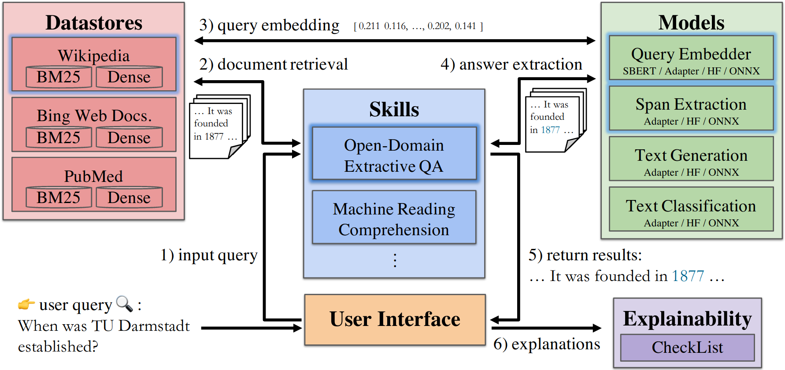

# Architecture

SQuARE is composed of 4 modules:

- **Datastores**: contains knowledge bases (e.g. ConceptNet) and indexes for large collections of documents (e.g. Wikipedia, PubMed). These indexes can be from 
  traditional systems such as BM25 or new dense retrieval systems such as Facebook’s DPR.
- **Models**: manages the three type of models used in SQuARE:
    - Embedding models for indexing documents.
    - Fine-tuned HuggingFace (HF) Transformer models for QA.
    - The backbone Transformer models for Adapters (e.g., bert-base-uncased)
- **Skills**: module defines a QA pipeline. The predefined available pipelines are: 
  - **Extractive**: the input is a question and optionally a context (i.e., a short passage) and the answer is a subspan of the context. If the context is not given, the Skill needs to make use of a datastore and an index to retrieve a relevant document that may contain the answer.
  - **Multiple Choice**: the input is a question, a list of candidate answers, and optinally a context. The Skill has to identify the correct answer from the list of candidate answers.
  - **Categorical**: it is a special case of multiple-choice where only two candiate answers are available, true/false or yes/no.
  - **Abstractive**: similar to extractive, the input is a question and a context, but the answer is not a subspan of the context, instead it is a free-form text based on the context.
  - **Information Retrieval (IR)**: the input is a question and the Skill needs to retrieve a relevant document.
  - **User Interface**: allows the user to interact with the Skills.
