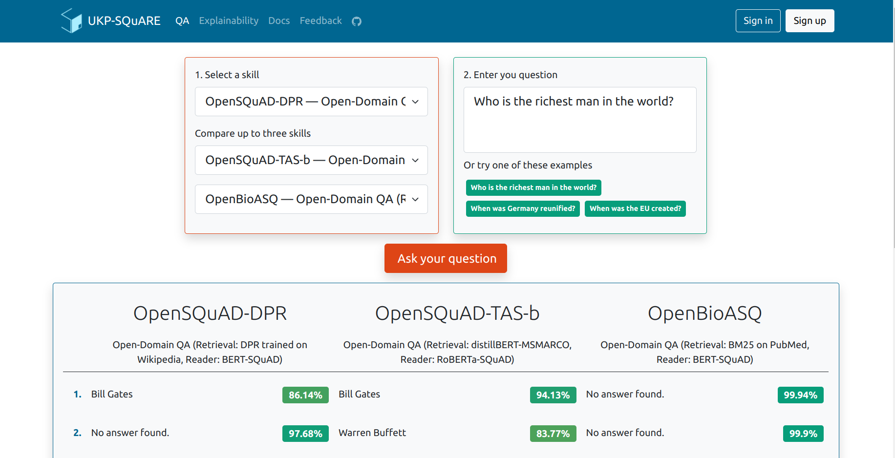
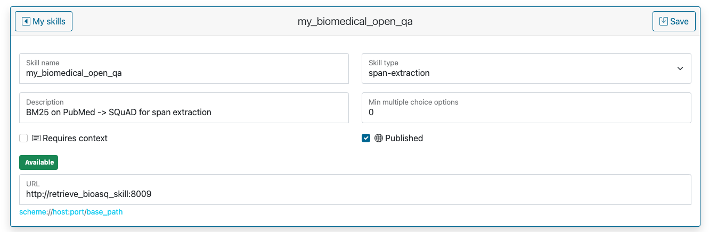

# Get Started

We support two ways to use SQuARE:
1. 🌐 Get access to the existing QA Skills (and even deploy your Skill!) via our [demo page](https://square.ukp-lab.de/).
2. 💾 Or clone and install SQuARE to host services on a local machine.

👉 If you want to use the SQuARE public service online, you can refer to [Online Service](#Online-Service) for using the existing skills and refer to 
[Add New Skills](#Add-New-Skills) for adding new skills.

👉 If you want to deploy SQuARE locally yourself, please refer to [Local Installation](#Local-Installation).

<a name="Online-Service"></a>

## Online Service
Try out the on-the-go skills on the [demo page](https://square.ukp-lab.de/)! 
The existing skills include span-extraction, abstractive, multi-choice QA 
with contexts or without contexts (open QA based on retrieval).



<a name="Add-New-Skills"></a>

## Add New Skills

### Step 1: Hosting New Skills
- If you want to add new skills to the [public service](https://square.ukp-lab.de/), please follow the skill-package examples (e.g. [skills/qa-retrieve-span-skill](https://github.com/UKP-SQuARE/square-core/tree/master/skills/qa-retrieve-span-skill)) and submit yours via a [pull request](https://github.com/UKP-SQuARE/square-core/pulls). We will make it run after code review;
- It is also OK to host the skill yourself somewhere else. The only thing that matters here is to provide a URL and also match the argument formats.


### Step 2: Register the Skill
Go to your user profile and click on "My Skills" and "New" buttons. Fill out the form and link it to the hosted skills:




<a name="Local-Installation"></a>

## Local Installation
### Environment Configuration
1. Create .env files from examples
    - First, let's initialize the .env files from our examples. Run the following lines:  
    ```bash
    mv skill-manager/.env.example skill-manager/.env 
    mv datastore-api/.env.example datastore-api/.env 
    mv skills/.env.example skills/.env 
    cp square-frontend/.env.production square-frontend/.env.production-backup
    cp square-frontend/.env.development square-frontend/.env.production
    ```
    - For the _Skill-Manager_ (`./skill-manager/.env`) you can update the `MONGO_INITDB_ROOT_USERNAME` and `MONGO_INITDB_ROOT_PASSWORD` for production purposes.
    - In the _Datastore-API_ env file (`./datastore-api/.env`)  enter an `API_KEY`. This will secure the API, and only requests containing this key will be allowed.
    - Copy the API key from the datastores to the _Skills_ env file (`./skills/.env`)
2. Update docker-compose.yaml (staging only)
    - The `docker-compose.yaml` file contains several mentions of _Development_ and _Production_. For the local setup, we need to enable the development and disable the production settings.
    - If you have downloaded the huggingface models already and want to avoid downloading them again (which will take some time during application startup), change the .cache directory volume mapping in the model services respectively.
3. Pull and Build Images
    - First pull the latest images.
    ```bash
    docker-compose pull
    ```
    - For the local setup we need to rebuild the frontend image to use the updated env file.
    ```bash
    docker-compose build frontend
    ```
4. Run
    ```bash
    docker-compose up -d
    ```
    Check with `docker-compose logs -f` if all systems have started successfully. Once they are up and running go to https://square.ukp-lab.localhost.
    👉 Accept that the browser cannot verify the certificate.

## Citation

Coming soon!

<!-- If you find this repository helpful, feel free to cite our publication 
[UKP-SQUARE: An Online Platform for Question Answering Research]():

```
@inproceedings{
}
``` -->