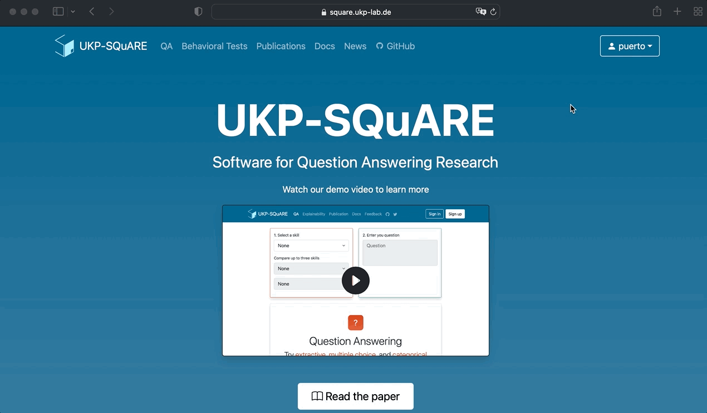
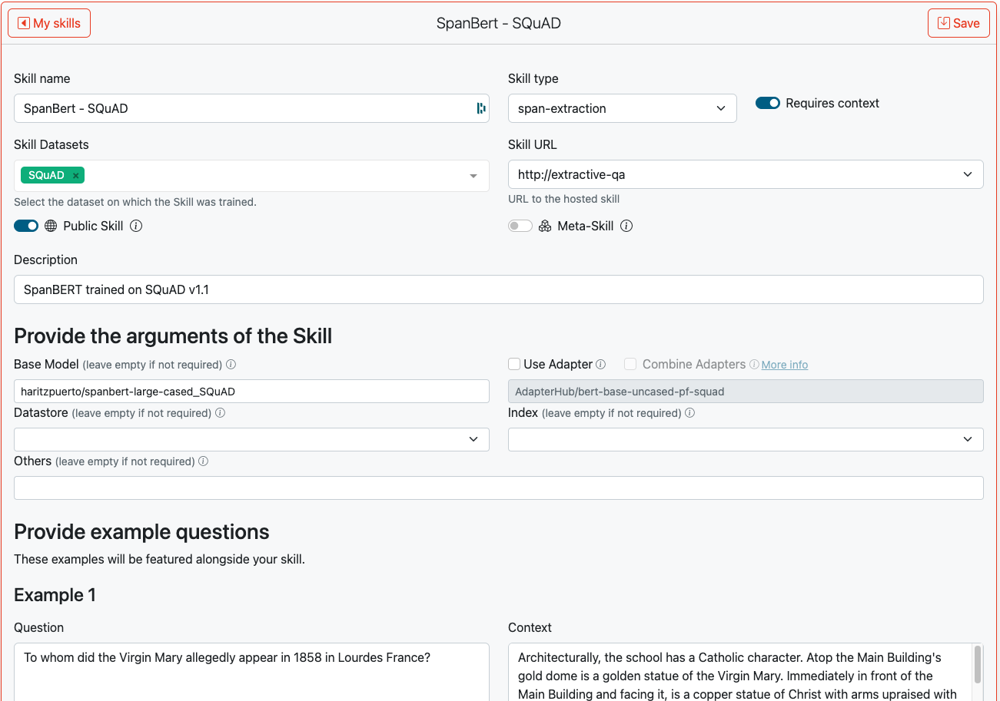
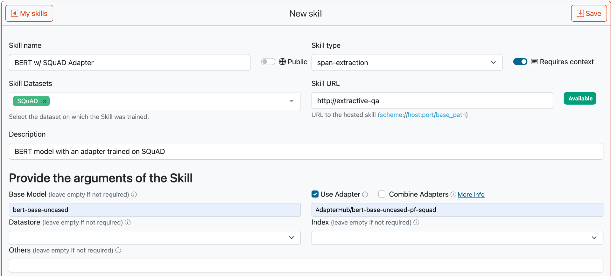
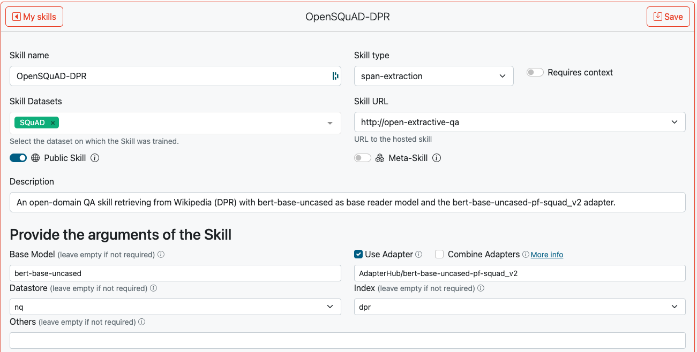

# Get Started

Try the SQuARE platform using any browswer on [https://square.ukp-lab.de/](https://square.ukp-lab.de/)! 
We already have dozens of *Skills* (#What-is-a-Skill) including span-extraction, abstractive, multi-choice QA 
with contexts or without contexts (open QA based on retrieval).


<a name="What-is-a-Skill"></a>

## What is a Skill?
A Skill is a QA pipeline. It defines a datastore, a retrieval model, a reader model, and a data preprocessing and postprocessing steps. All components are optional, allowing maximum flexibility to the user.

A **retrieval model** is a model that given a question, retrieves relevant documents.

A **reader model** is a model that given a question and a passage, reads the passage and *reasons* over it to identify the answer, usually a subspan.


## Running a Skill
To run a Skill, you need to go to the QA page in the navigation bar. Then, select one Skill and write the inputs, usually a question, a context, and candidate answers for multiple-choice Skills. We have defined four types of Skills:
- **Extractive**: the input is a question and optionally a context (i.e., a short passage) and the answer is a subspan of the context. If the context is not given, the Skill needs to make use of a datastore and an index to retrieve a relevant document that may contain the answer.
- **Multiple Choice**: the input is a question, a list of candidate answers, and optinally a context. The Skill has to identify the correct answer from the list of candidate answers.
- **Categorical**: it is a special case of multiple-choice where only two candiate answers are available, true/false or yes/no.
- **Abstractive**: similar to extractive, the input is a question and a context, but the answer is not a subspan of the context, instead it is a free-form text based on the context.
- **Information Retrieval (IR)**: the input is a question and the Skill needs to retrieve a relevant document.

<a name="Add-New-Skills"></a>

## Deploying New Skills
Deploying a Skill is a simple as filling a form. You can find this form after loggin in, clicking the button on the top-right with your name as shown in the GIF below. Next, we will show you how to deploy a basic Skill (i.e., a Skill that is only composed of a reader model), and how to deploy more advanced Skills (i.e., Skills that makes use of a pipeline). 



### Deploying a Basic Skill
If you want to deploy a QA model such as https://huggingface.co/haritzpuerto/spanbert-large-cased_SQuAD in SQuARE, you just need to write the HuggingFace's id of the model (i.e., `haritzpuerto/spanbert-large-cased_SQuAD`) in this example, and fill the metadata of the Skill. In particular, you would need to write:
- Skill name.
- Skill type: abstractive, span-extraction, multiple-choice, categorical (a.k.a. boolean) or information-retrieval.
- Whether it requires a context/passage as input alongside the question.
- The dataset it was trained on.
- Whether the Skill is publicly available for any user or only visible for you.
- Short description.

Please, do not forget to upload the tokenizer of your model to the HuggingFace repository so that SQuARE can know the tokenizer needed.  The Figure below shows an example of how the Skill creation page should look.



### Deploying an Advanced Skill
If you want to deploy a Skill that uses Adapter weights, you can also do it in SQuARE. It is the same as with the basic skill shown above, but you would need to specify the base model (e.g.: `bert-base-uncased`), then check the `Use Adapter` checkbox, and finally write the id of your adapter in HuggingFace or AdapterHub. The Figure below shows an example.



Lastly, we will show you how to deploy a Skill that has a pipeline, such as a retriever and reader models, you can also do it on SQuARE.
If your Skill makes use of a Datastore, such as Wikipedia, first, you need to turn-off the switch for `requires context` because the context is not given by the user, but retrieved by the Skill from the Datastore. Then, you need to select a Datastore (eg: NaturalQuestions - Wikipedia), and then the index (eg: BM25 or DPR). The Figure below shows as an example of a Skill using the Wikipedia dump provided by Natural Questiosn dataset, indexed with DPR, and with BERT+SQuAD Adapter as reader.



## Implementing a New Skill
If you want to *implement* a new Skill (i.e., create a new QA pipeline), please follow the skill package examples (e.g. [skills/local](https://github.com/UKP-SQuARE/square-core/blob/master/skills/local/skill.py)) and submit yours via a [pull request](https://github.com/UKP-SQuARE/square-core/pulls). We will make it run after code review.

You can also host the Skill yourself in a cloud environment outside of SQuARE. In this case, you would only need to provide the URL to your running Skill when deploying the Skill. 


## Citation

If you find this repository helpful, feel free to cite our publications:

- ACL 2022 [UKP-SQUARE: An Online Platform for Question Answering Research](https://aclanthology.org/2022.acl-demo.2/):
```
@inproceedings{baumgartner-etal-2022-ukp,
    title = "{UKP}-{SQ}u{ARE}: An Online Platform for Question Answering Research",
    author = {Baumg{\"a}rtner, Tim  and
      Wang, Kexin  and
      Sachdeva, Rachneet  and
      Geigle, Gregor  and
      Eichler, Max  and
      Poth, Clifton  and
      Sterz, Hannah  and
      Puerto, Haritz  and
      Ribeiro, Leonardo F. R.  and
      Pfeiffer, Jonas  and
      Reimers, Nils  and
      {\c{S}}ahin, G{\"o}zde  and
      Gurevych, Iryna},
    booktitle = "Proceedings of the 60th Annual Meeting of the Association for Computational Linguistics: System Demonstrations",
    month = may,
    year = "2022",
    address = "Dublin, Ireland",
    publisher = "Association for Computational Linguistics",
    url = "https://aclanthology.org/2022.acl-demo.2",
    doi = "10.18653/v1/2022.acl-demo.2",
    pages = "9--22",
}
```
- AACL 2022 [UKP-SQUARE v2: Explainability and Adversarial Attacks for Trustworthy QA](https://aclanthology.org/2022.aacl-demo.4/):
```
@inproceedings{sachdeva-etal-2022-ukp,
    title = "{UKP}-{SQ}u{ARE} v2: Explainability and Adversarial Attacks for Trustworthy {QA}",
    author = {Sachdeva, Rachneet  and
      Puerto, Haritz  and
      Baumg{\"a}rtner, Tim  and
      Tariverdian, Sewin  and
      Zhang, Hao  and
      Wang, Kexin  and
      Saadi, Hossain Shaikh  and
      Ribeiro, Leonardo F. R.  and
      Gurevych, Iryna},
    booktitle = "Proceedings of the 2nd Conference of the Asia-Pacific Chapter of the Association for Computational Linguistics and the 12th International Joint Conference on Natural Language Processing: System Demonstrations",
    month = nov,
    year = "2022",
    address = "Taipei, Taiwan",
    publisher = "Association for Computational Linguistics",
    url = "https://aclanthology.org/2022.aacl-demo.4",
    pages = "28--38",
}
```
