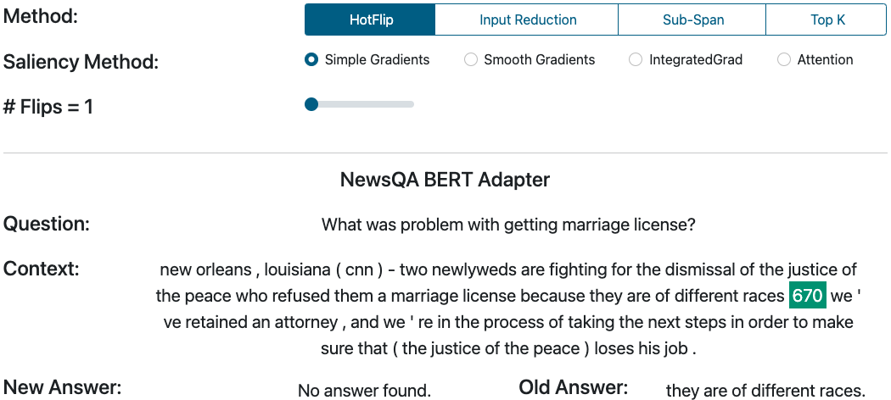

# Use Cases

## 1. Querying Skills
SQuARE allows users to query Skills without downloading models, installing software packages, etc. Our [demo page](https://square.ukp-lab.de/) offers a wide range of Skills hosted on our servers so that only a browser and an Internet connection are needed to run them. Thanks to this, users can easily conduct qualitative analysis to identify potential biases, strengths, or weaknesses.

## 2. Comparing Skills
SQuARE also allows querying up to three Skills in parallel to compare them conveniently. The interface shows the answers of the Skills next to each other to compare them effortlessly.

## 3. Deploying Skills
SQuARE allows anyone to upload their own Skills onto the platform so that they can be used by other users. Publishing a new Skill requires implementing a single function that defines the question answering pipeline. This empowers practitioners and researchers by hiding software engineering and infrastructure topics and enabling them to focus only on research.

## 4. Understanding the General Behavior of the Skills
SQuARE includes an explainability module to understand the general behavior of the Skills. This is possible thanks to [Checklist](https://github.com/marcotcr/checklist), a behavioral testing suite for NLP that analyzes the linguistic capabilities of NLP models. Currently, only some selected Skills are available, but we are continuously working to bring you more.

## 5. Studying the Explainability of Skills
The continuous adoption of AI systems is making explaining their outputs more and more important. For example, if you are using a question-answering (QA) system for medical domains, the doctor would require the diagnosis from the model along with an explanation. A diagnosis alone is not useful and it can even be dangerous in case the machine made a mistake! However, neural networks are black boxes that give predictions but are not interpretable. Hence, many researchers have worked to provide methods to explain these models. One of these methods are **Saliency Maps**. They assign an *attribution* weight to the input tokens to assess their importance in the model prediction. UKP-SQuARE provides the main two families of attribution methods:  i) Gradient-based methods and ii) Attention-based methods. With them, you can explore whether the Skills and interpretable or not, and whether they can be used in scenarios that requires a human interpretation.

More technical details in: [Explainability in Question Answering, Medium 2022](https://medium.com/@ukp-square/explainability-in-question-answering-96520be8876d)

## 6. Analyzing the Robustness of Skills through Adversarial Attacks
It is well-known that is possible to “trick” machine learning systems. For instance, [Goodfellow et al. (2014)](https://arxiv.org/abs/1412.6572) shows that a clear picture of a panda can be modified with some invisible noise for humans that makes the ML model classify it as a gibbon.

In Question Answering (QA), we can observe similar attacks. They slightly modify the inputs, such as a question or the context passage, to make the model change the predicted answer. For example, the Figure below uses the SQuARE platform to change one word of the context so that the new answer prediction changes.

“670” is a new token that substitutes the token “.” This change makes the model to return a different answer, and therefore, shows a successful attack to the model.

More technical details on: [Adversarial Attacks on Question Answering
 - Medium 2022](https://medium.com/@ukp-square/15ca411f8f78)

## 7. Understanding Graph-based Skills
Knowledge graphs store knowledge in the form of relations (edges) between entities (nodes). In addition to the explicit facts they represent, they
enable explainable predictions by providing reasoning paths [(Yasunaga et al., 2021)](https://aclanthology.org/2021.naacl-main.45/). UKP-SQuARE offers a graph visualization interface to simplify the study of the explainability capabilities of graph-based models.

## 8. Combining Skills
Combining Skills can make systems more modular and multi-domain. [Puerto et al., (2021)](https://arxiv.org/abs/2112.01922) showed that combining these models can yield performance gains of over 8 points with respect to multi-dataset models (i.e., a model trained on multiple datasets). These gains are especially relevant nowadays given the thousands of models readily available on online model hubs.

