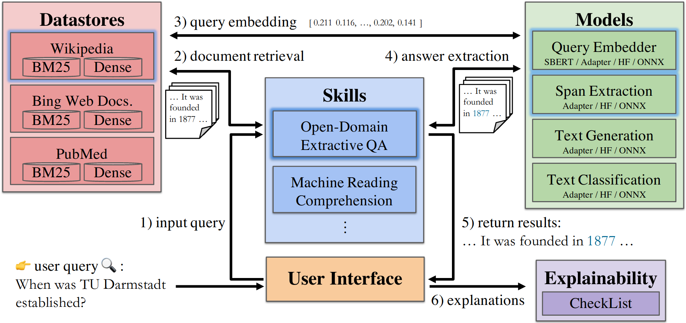

.. SQuARE Docs documentation master file, created by
   sphinx-quickstart on Mon Dec 27 13:03:18 2021.
   You can adapt this file completely to your liking, but it should at least
   contain the root `toctree` directive.

==================================================
SQuARE - Software for Question Answering Research
==================================================

.. note::
   To try out SQuARE directly, please visit the `SQuARE Website <https://square.ukp-lab.de>`_.

SQuARE is a scalable and flexible **open-source** QA platform that enables researchers and developers to:

* Share their custom QA agents by integrating them to our platform using easy-to-use common interfaces.
* Study the strengths and weaknesses of existing models by comparing them on a wide range of tasks and datasets that are already provided within our framework.
* Explore the existing models and datasets to answer more specific research questions using integrated interpretability tools.

Why SQuARE?
------------

Recent advances in NLP and information retrieval have given rise to a diverse set of question answering tasks
that are of different formats (e.g., extractive, abstractive), require different model architectures
(e.g., generative, discriminative) and setups (e.g., with or without retrieval). Despite having a large number
of powerful, specialized QA pipelines (a.k.a., Skills) that consider a single domain, model or setup, there exists
no framework where users can easily explore and compare such pipelines and can extend them according to their needs.

To address this issue, we present SQuARE, an extensible online QA platform for researchers which allows users to query
and analyze a large collection of modern Skills via a user-friendly web interface and integrated behavioural tests.
In addition, QA researchers can develop, manage and share their custom Skills using our microservices that support
a wide range of models (Transformers, Adapters, ONNX), datastores and retrieval techniques (e.g., sparse and dense).

.. note::
   Find out more about the project on `UKPs Website <https://www.informatik.tu-darmstadt.de/ukp/research_ukp/ukp_research_projects/ukp_project_square/ukp_project_square_details.en.jsp>`_.

Architecture
-------------

For a whole (open QA) skill pipeline, it requires 6 steps:

#. First a user selects a Skill and issues a query via the user interface;
#. The selected QA Skill forwards the query to the respective Datastore for document retrieval;
#. The Datastore gets the query embedding from the Models, uses it for semantic document retrieval and returns the top documents to the Skill;
#. The Skill sends the query and retrieved documents to the reader model for answer extraction;
#. Finally, the answers are shown to the user;
#. Optionally, the user can view the results of the predefined behavioural tests for the Skill.

.. toctree::
    :caption: Overview
    :maxdepth: 1
    :hidden:

    pages/overview/get_started.md
    pages/overview/use_cases.md
    pages/overview/tutorials.md
    pages/overview/roadmap.md
    pages/overview/faq.md

.. toctree::
    :caption: Components
    :maxdepth: 1
    :hidden:

    pages/components/datastores.md
    pages/components/models.md
    pages/components/skills.md
    pages/components/explainability.md

.. toctree::
    :caption: API
    :maxdepth: 1
    :hidden:

    pages/api/datastore_api/datastores.rst
    pages/api/model_api/models.rst
    pages/api/skill_api/skills.rst
