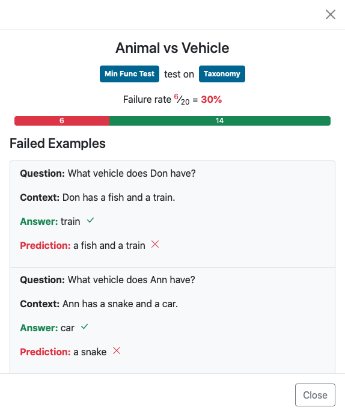

# Explainability
<link rel="stylesheet" type="text/css" media="all" href="../../_static/custom.css" />

### Overview

The SQuARE platform provides behavioral testing via [Checklist](https://github.com/marcotcr/checklist).
This is achieved by *unit  tests* designed by the end-users or the system experts.
The two most common types are *Minimum Functionality Test (MFT)* and 
*INVariance (INV)* as given in the table below.

| **M**inimum **F**unctionality **T**est (MFT)-*Taxonomy* | **INV**ariance-*Robustness* |
| :-- | :-- |
| **C:** There is a tiny purple box in the room.  |**C:** ...Newcomen designs had a duty of about 7 million, but most were closer to 5 million....  
**Q:** What size is the box?  | **Q:** What was the ideal [duty->udty] of a Newcomen engine?  
**Test:** Check if the prediction is tiny  | **Test:** Check whether the prediction changes or not.  |

MFTs are designed to measure a capability (e.g., Taxonomy capacity of 
matching object properties to categories) via specifying the expected
behaviour (e.g., “tiny” in Table above). INVs tests are similarly
refined for capabilities (e.g., robustness under spelling errors in question),
however the expected behaviour is already known, i.e., the answer should
remain the same.

### Currently supported skills

- **SQuADv2**: Uses Adapter for bert-base-uncased in Pfeiffer architecture trained on the `SQuAD 2.0` dataset .
- **BoolQ**: Uses Adapter for the bert-base-uncased model that was trained on the `qa/boolq` dataset.
- **Extractive**: General skill to use different extractive models on [AdapterHub](https://adapterhub.ml/) and [HuggingFace](https://huggingface.co/models).

Check out these skills on the [SQuARE platform](https://square.ukp-lab.de).

### Behavioral testing of skills

The users can choose the Skill they want to investigate from the
drop-down menu. The `Show Checklist' button is activated once
the predictions from the tests are saved in a *JSON* file.

Most tests are displayed showing the correct answer and prediction 
alongside the question and context. An examplary visualization for
vocabulary testing of SQuAD skill is given in Figure below. 

For replacement tests, e.g., where names are perturbed, colored markers
are used to highlight how the input was modified for the test.
This allows the user to quickly identify changes the Skill could not 
handle. To analyze or process a Skill’s test performance in more detail, 
a full *JSON* report of all test examples can be downloaded. 

